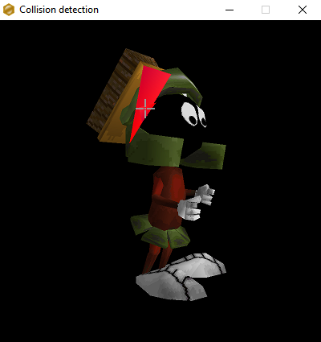
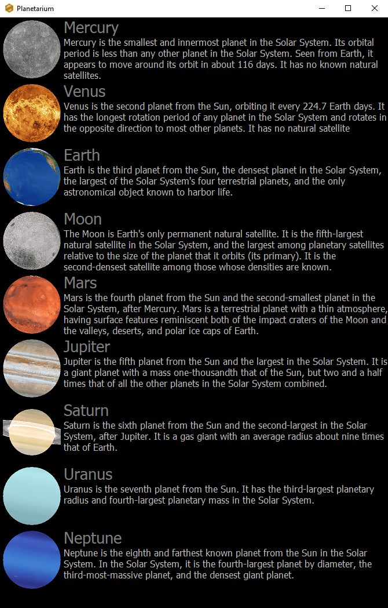

# Mels
Mels is an open source library and component set, written in Delphi, and designed for Embarcadero RAD studio and Lazarus, that allows to include 3D models in your projects in a few clicks, just as any other graphical components.

##supported features
- Simple shapes: surface, cube, sphere, cylinder, cone, torus and parabola
- Texturing for shapes
- Animated 3D models
- Ray picking, allowing e.g a mouse cursor to know on which part of the model it hovers
- Music player (.wav format)

Mels also provides you a direct access to to the component scene, allowing thus to customize it as you want.

## 3D models
The Mels library supports the following model formats:
- Quake I (.mdl)
- Quake II (.md2)
- Quake III (.md3)

Several plugins exist to export such models from Blender, you may find them on the following websites:
- http://quakeforge.net/files.php for the Quake I (.mdl) models
- https://www.rockraidersunited.com/topic/8175-md2-blender-importexport-add-on-early-release/ for the Quake II (.md2) models
- https://github.com/neumond/blender-md3 for the Quake III (.md3) models

<b>NOTE</b> several versions of Blender should provide a .md2 importer/exporter natively.

For the beginners, here is also an interesting article about how to create a Quake I model with Blender:
https://pnahratow.github.io/creating-models-for-quake-1.html

## Third-party
Mels depends on the following third-party libraries to compile:
- OpenGL
- OpenAL
- Glew

For Lazarus, the following module is also required:
- Generics.Collections

A copy of these libraries was added to the project, you can find them in the Library\Prerequisites\ folder.

## screenshots
|Ray picking demo.|
|--------|
||

|Planetarium demo.|
|--------|
||

